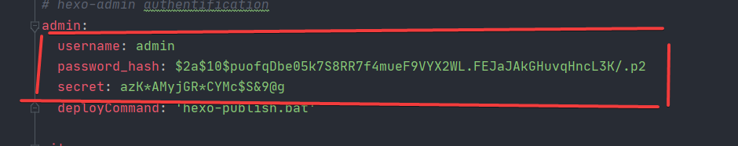

## 更改默认server端口(必改)
*更换hexo的默认端口*

hexo的默认server端口是4000，其与中国大部分软件使用的端口都冲突(主要是腾讯系，包括foxmail)

所以建议更改默认的server端口,我已经帮您改好了，具体的方法如下：

### 可以每次启动server都使用指定命令

```cmd
hexo s -p 5000 -debug
```

### 永久方法(推荐)
**已经改好**
在根目录_config.yml文件中加入下列配置：(推荐在最后一行)

```yaml
server:
  port: 5000
  compress: true
  header: true
```

## hexo-git-backup插件(已选)

```cmd
npm install hexo-git-backup
```
**已经选择这项功能，您只需要启动**

启动命令
```shell
hexo b
or
hexo backup
```

## hexo-admin后台管理插件(已选)

```cmd
npm install --save hexo-admin
```
**已经选择这项功能，您只需要启动**

在本地的server中，浏览器的地址栏添加`/admin`

例如，
```txt
http://localhost:5000/admin
```


### 用户重置admin登录密码
如果您第一次使用这项功能或者忘记了登录密码，您需要重置登录密码

在根目录中的_config.yml，删除以下内容:



只需删除:

```cmd
username:*********
password_hash:**********
secret:***********
```
### hexo-admin后台管理插件doc

[使用 hexo-admin 後台管理工具](https://ed521.github.io/2019/08/hexo-admin/)

[Hexo-Admin博客后端管理工具](https://thistgg.github.io/2017/03/23/Hexo-Admin%E5%8D%9A%E5%AE%A2%E5%90%8E%E7%AB%AF%E7%AE%A1%E7%90%86%E5%B7%A5%E5%85%B7/)

## 一键发布 deploy(已选)

新建`hexo-publish.bat`,内容为

```cmd
hexo g -d
```
**已经选择这项功能，您只需要启动**

在本地服务器(`server`)管理后台(`hexo-admin`后台)直接点击部署按钮(`deploy`)

在实际操作过程中,其实只是执行了`hexo g -d`命令